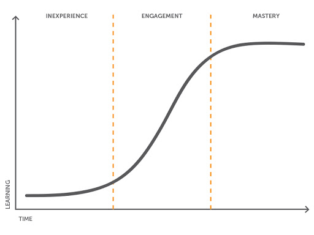
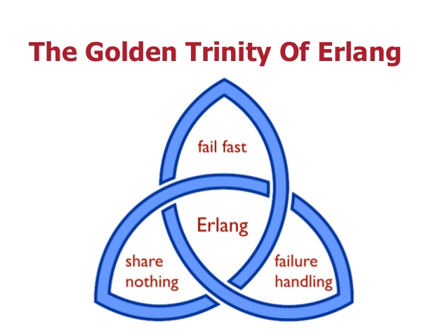

layout: true

.signature[@algogrit]

---

class: center, middle

# Why Elixir

Gaurav Agarwal

---

# Agenda

- Elixir is *AWESOME*

---

class: center, middle


Software Engineer & Product Developer

Director of Engineering & Founder @ https://codermana.com

ex-Tarka Labs, ex-BrowserStack, ex-ThoughtWorks

---

class: center, middle

*What we wanted*


---

class: center, middle

*What we got*


---

## As a instructor

- I promise to

  - make this class as interactive as possible

  - use as many resources as available to keep you engaged

  - ensure everyone's questions are addressed

---

## What I need from you

- Be vocal

  - Let me know if there any audio/video issues ASAP

  - Feel free to interrupt me and ask me questions

- Be punctual

- Give feedback

- Work on the exercises

- Be *on mute* unless you are speaking

---
class: center, middle

## Class progression



---
class: center, middle

Here you are trying to *learn* something, while here your *brain* is doing you a favor by making sure the learning doesn't stick!

---

### Some tips

- Slow down => stop & think
  - listen for the questions and answer

- Do the exercises
  - not add-ons; not optional

- There are no dumb questions!

- Drink water. Lots of it!

---

### Some tips (continued)

- Take notes
  - Try: *Repetitive Spaced Out Learning*

- Talk about it out loud

- Listen to your brain

- *Experiment!*

---
class: center, middle

### 📚 Content ` > ` 🕒 Time

---
class: center, middle

## Show of hands

*Yay's - in Chat*

---

# Elixir

- general purpose
- Created by Jose Valim and came out in 2012
- concurrent
- dynamic
- well suited for building fault-tolerant & highly-available systems

---
class: center, middle

## Elixir's Programming Style

---
class: center, middle

```elixir
IO.puts "Hello, World!"
```

---

- Heavily influenced by FP

- Immutable

- Combines the best of Erlang & Ruby

- Adopts Fail Fast / Let it crash

- Distributed

---
class: center, middle

### Heavily influenced by FP

---

- map

- reduce

- filter

- fold*

- ...

---
class: center, middle

### Immutable

---
class: center, middle

All data structures in Elixir are immutable by default. This means that once a data structure is created, its contents cannot be modified.

---
class: center, middle

Instead, any operation that seems like it would modify the structure actually returns a new copy of the structure with the desired changes.

---

- Reliable Parallelism
  - Since data cannot be changed once created, multiple processes or threads can operate on the same data without the fear of unexpected modifications.

- Enhanced Robustness
  - Immutability contributes to code robustness by minimizing the chances of bugs caused by unintended side effects.

- Efficient Memory Usage

  - Immutable data structures can also lead to more efficient memory usage. Since data is not modified in place, new versions of the data can share memory with the original data, reducing the need for copying large amounts of data.

.content-credits[https://clouddevs.com/elixir/immutability-and-data-structures/]

---
class: center, middle

### Combines the best of Erlang & Ruby

---
class: center, middle

#### Erlang

Elixir is a functional programming language built on the BEAM, a foundation that's almost 40 years old.

---

BEAM is a one-of-a-kind runtime that utilizes parallelism and fault tolerance.

- Elixir applications behave predictably when things go wrong.

- Elixir applications can fully utilize all CPU cores without having to write complex code.

- No other language on the planet can achieve the same level of parallelism with the ease of writing the code.

- Simply put, Elixir has an unparalleled capability to manage high levels of concurrency and handle faults while allowing clean code writing.

---
class: center, middle

Although BEAM was created for Erlang, several other languages have been either created for it or ported to run on it. The most popular of these is **Elixir**, which had more responses than Erlang itself in the 2023 Stackoverflow survey.

.content-credits[https://survey.stackoverflow.co/2023/#most-popular-technologies-language]

---
class: center, middle

#### Ruby

Elixir's syntax is inspired by Ruby but has a more functional programming focus. It emphasizes immutability, concurrency, and scalability. Elixir is designed for building highly concurrent and distributed systems.

---
class: center, middle

Ruby is often chosen for its simplicity, readability, and mature ecosystem, especially in web development

while Elixir shines in building highly concurrent, fault-tolerant, and scalable systems.

---
class: center, middle

### Adopts Fail Fast / Let it crash

---
class: center, middle



---
class: center, middle

### Distributed

---
class: center, middle

OTP (Open Telecom Platform) is aimed at providing time-saving and flexible development for robust, adaptable telecom systems. It consists of an Erlang runtime system, a number of ready-to-use components mainly written in Erlang, and a set of design principles for Erlang programs.

---
class: center, middle

### *Others*

---

- Dynamically Typed

- Pattern Matching

- Battle tested runtime with Beam

- Good enough standard library

- Amazing community!

---

## Companies using Elixir

- Pinterest
- PepsiCo
- Slack
- Bleacher Report
- Discord
- Postmates
- Toyota Connected
- Moz Pro
- Financial Times
- Lonely Planet
- ...

---
class: center, middle

### Case-studies

---

#### Bleacher Report: From 150 Servers to Just 8

- Erlang Solutions worked with Bleacher Report to help them move their system from Ruby to Elixir.

Efficiently managing more than 200 million daily push notifications. The system achieves over 1.5 billion monthly page views at its peak performance, all while utilizing a mere 8 servers.

- Ability to handle 8x the traffic without autoscaling

- Adding content to all streams went from 30-40 seconds to 3-4 seconds

- 95th percentile latency hovers around 100ms and is not noticeably affected by traffic spikes

- Runs on about 1/10th of the servers with low CPU utilization

- 10x reduction in the time it takes to update the site

- The system easily handles over 200 million push notifications per day

.content-credits[https://www.erlang-solutions.com/case-studies/bleacher-report-case-study/]

---

#### Why WhatsApp Only Needs 50 Engineers for Its 900M Users

WhatsApp utilizes Erlang for concurrent programming, as internet services demand more efficient languages to handle increasing tasks. WhatsApp's success lies in focusing on core tasks, minimizing distractions, and avoiding meetings.

Back in 2011, WhatsApp was able to handle one million established TCP sessions on a single machine, with plenty of memory and CPU capacity to spare.

Back in 2013, WhatsApp managed to process a whopping 18 billion messages within just 24 hours. This included 7 billion incoming messages and 11 billion outgoing messages.

.content-credits[https://www.wired.com/2015/09/whatsapp-serves-900-million-users-50-engineers/]

---

#### Discord: 5,000,000 Concurrent Users and Millions of Events per Second

Discord embraced Elixir early, leveraging the Erlang VM for a highly concurrent, real-time system. The Elixir prototype established today's infrastructure.

The lookup cost of ETS is reduced from 17.5 seconds to 0.3us thanks to FastGlobal.

.content-credits[https://discord.com/blog/how-discord-scaled-elixir-to-5-000-000-concurrent-users]

---

#### More

- [Orchestrating computer vision with Elixir at V7](https://elixir-lang.org/blog/2021/01/13/orchestrating-computer-vision-with-elixir-at-v7/)

- [Embedded Elixir at Farmbot](https://elixir-lang.org/blog/2020/08/20/embedded-elixir-at-farmbot/)

- [PaaS with Elixir at Heroku](https://elixir-lang.org/blog/2020/09/24/paas-with-elixir-at-Heroku/)

- ...

.content-credits[https://elixir-lang.org/cases.html]

---
class: center, middle

## Where Elixir doesn't shine?

---

- *nil*

- Dynamically typed

- Developer Tools

---

## Open Source Software

- Supabase Realtime

  Realtime is an application for listening to changes in your PostgreSQL database. It’s a Phoenix server that listens to PostgreSQL’s replication functionality, converts the byte stream into JSON, and then broadcasts it over websockets.

- Absinthe

  Absinthe is an Elixir implementation of GraphQL. Absinthe implements the working draft of GraphQL while providing a nice, idiomatic API for Elixir users.

- Hex

  Hex is a package manager for Erlang and Elixir that hosts over 11 000 public packages.

- ...

---
class: center, middle

## Is Elixir only a systems programming language?

---

Web development: Elixir, with its Phoenix framework, provides a powerful environment for building web applications. Phoenix leverages Elixir's concurrency model and fault-tolerance features to create highly responsive and resilient web applications.

Real-time applications: Elixir's concurrency model, based on lightweight processes, makes it well-suited for real-time applications such as chat systems, multiplayer games, and streaming platforms.

IoT (Internet of Things): Elixir's lightweight processes and fault-tolerance features are advantageous for building IoT applications that require handling a large number of concurrent connections and managing distributed systems.

...

---

...

Distributed systems: Elixir's built-in support for distributed computing, along with features like fault tolerance and hot code swapping, makes it an excellent choice for developing distributed systems, such as distributed databases and messaging systems.

DevOps tools: Elixir is used in the development of various DevOps tools and platforms due to its ability to handle concurrent operations efficiently and its fault-tolerance features.

---
class: center, middle

Code
https://github.com/AgarwalConsulting/elixir_training

Slides
https://elixir.slides.agarwalconsulting.com
